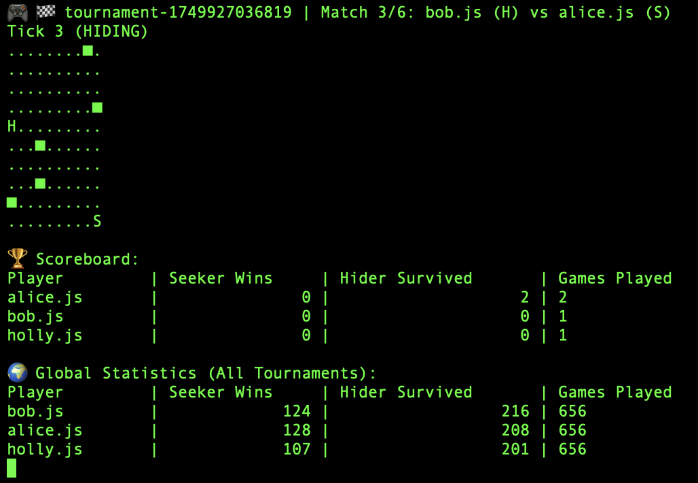

# Hide and geek

A terminal-based hide and seek game. 

## How it works

Write your own logic in a .js file inside the players folder.
Feel free to remove the example players.

Start tournament 

`bash run.sh`

## Requirements

- Node
